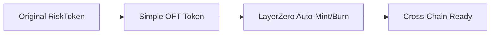

# 🚀 Hackathon Quick Implementation: Cross-Chain Risk Tokens

## TL;DR - Fastest Path to Cross-Chain Tokens

For hackathon speed, we'll use **cross-chain minting** approach - much simpler than the hybrid vault-controlled approach I documented earlier.

## ⚡ Why This is Faster

### Original Approach (Complex)
- Dual access control (vault + LayerZero)
- Custom debit/credit logic
- Vault integration complexity
- ~2-3 days implementation

### Hackathon Approach (Simple) 
- Standard OFT implementation
- Built-in LayerZero mint/burn
- Minimal custom logic
- **~4-6 hours implementation**

## 🎯 Simplified Architecture



## 📝 Implementation Plan

### Step 1: Convert RiskToken to Simple OFT (30 minutes)

Replace your current [`RiskToken.sol`](../contracts/RiskToken.sol) with this simplified version:

```solidity
// SPDX-License-Identifier: MIT
pragma solidity ^0.8.28;

import "@layerzerolabs/lz-evm-oapp-v2/contracts/oft/OFT.sol";
import "@openzeppelin/contracts/access/Ownable.sol";

contract SimpleOFTRiskToken is OFT {
    address public vault;
    
    modifier onlyVault() {
        require(msg.sender == vault, "Only vault can call");
        _;
    }
    
    constructor(
        string memory _name,
        string memory _symbol,
        address _lzEndpoint,
        address _delegate,
        address _vault
    ) OFT(_name, _symbol, _lzEndpoint, _delegate) {
        vault = _vault;
    }
    
    // Vault can mint for deposits
    function vaultMint(address to, uint256 amount) external onlyVault {
        _mint(to, amount);
    }
    
    // Vault can burn for withdrawals  
    function vaultBurn(address from, uint256 amount) external onlyVault {
        _burn(from, amount);
    }
    
    // LayerZero handles cross-chain automatically
    // No custom _debit/_credit needed!
}
```

### Step 2: Update Vault (30 minutes)

Minimal changes to [`RiskVault.sol`](../contracts/RiskVault.sol):

```solidity
// In constructor, change this:
RiskToken _seniorToken = new RiskToken("CoverVault Senior Token", "CV-SENIOR");

// To this:
SimpleOFTRiskToken _seniorToken = new SimpleOFTRiskToken(
    "CoverVault Senior Token", 
    "CV-SENIOR",
    _lzEndpoint,  // LayerZero endpoint
    msg.sender,   // delegate
    address(this) // vault
);
```

### Step 3: Quick Deploy Script (20 minutes)

```typescript
// deploy/hackathon-deploy.ts
import { DeployFunction } from 'hardhat-deploy/types'

const deployFunction: DeployFunction = async function (hre) {
    const { deployments, getNamedAccounts } = hre
    const { deploy } = deployments
    const { deployer } = await getNamedAccounts()

    // LayerZero endpoints (testnets for hackathon)
    const endpoints = {
        sepolia: '0x6EDCE65403992e310A62460808c4b910D972f10f',
        fuji: '0x6EDCE65403992e310A62460808c4b910D972f10f',
        mumbai: '0x6EDCE65403992e310A62460808c4b910D972f10f',
    }

    const lzEndpoint = endpoints[hre.network.name]
    
    // Deploy senior token
    await deploy('SeniorToken', {
        contract: 'SimpleOFTRiskToken',
        from: deployer,
        args: [
            'CoverVault Senior Token',
            'CV-SENIOR', 
            lzEndpoint,
            deployer,
            deployer // temp vault
        ],
        log: true,
    })

    // Deploy junior token
    await deploy('JuniorToken', {
        contract: 'SimpleOFTRiskToken', 
        from: deployer,
        args: [
            'CoverVault Junior Token',
            'CV-JUNIOR',
            lzEndpoint,
            deployer,
            deployer // temp vault
        ],
        log: true,
    })
}

export default deployFunction
```

### Step 4: LayerZero Config (15 minutes)

```typescript
// layerzero.config.ts
import { EndpointId } from '@layerzerolabs/lz-definitions'

const config = {
    contracts: [
        {
            eid: EndpointId.SEPOLIA_V2_TESTNET,
            contractName: 'SeniorToken',
        },
        {
            eid: EndpointId.AVALANCHE_V2_TESTNET, 
            contractName: 'SeniorToken',
        },
        {
            eid: EndpointId.POLYGON_V2_TESTNET,
            contractName: 'SeniorToken', 
        },
    ],
    connections: [
        {
            from: { eid: EndpointId.SEPOLIA_V2_TESTNET, contractName: 'SeniorToken' },
            to: { eid: EndpointId.AVALANCHE_V2_TESTNET, contractName: 'SeniorToken' },
        },
        {
            from: { eid: EndpointId.AVALANCHE_V2_TESTNET, contractName: 'SeniorToken' },
            to: { eid: EndpointId.SEPOLIA_V2_TESTNET, contractName: 'SeniorToken' },
        },
        // Add more connections as needed
    ],
}

export default config
```

## 🚀 Deployment Commands

```bash
# Install LayerZero dependencies (2 minutes)
npm install @layerzerolabs/lz-evm-oapp-v2 @layerzerolabs/lz-definitions

# Deploy to testnets (5 minutes)
npx hardhat deploy --network sepolia,fuji,mumbai

# Wire contracts (2 minutes)  
npx hardhat lz:oapp:wire --oapp-config layerzero.config.ts

# Test cross-chain transfer (1 minute)
npx hardhat lz:oft:send --src-eid 40161 --dst-eid 40106 --to 0x... --amount 1000000000000000000
```

## 📋 Hackathon Implementation Checklist

### Core Functionality (2-3 hours)
- [ ] **30 min**: Convert RiskToken to SimpleOFTRiskToken
- [ ] **30 min**: Update RiskVault constructor  
- [ ] **20 min**: Create deployment script
- [ ] **15 min**: Create LayerZero config
- [ ] **10 min**: Install dependencies
- [ ] **30 min**: Deploy to 2-3 testnets
- [ ] **15 min**: Wire contracts
- [ ] **30 min**: Test cross-chain transfers

### Demo Features (1-2 hours)
- [ ] **30 min**: Simple frontend integration
- [ ] **20 min**: Cross-chain transfer button
- [ ] **20 min**: Balance display across chains
- [ ] **30 min**: Demo script/presentation

### Polish (1 hour)
- [ ] **20 min**: Error handling
- [ ] **20 min**: Loading states
- [ ] **20 min**: Documentation

## 🎯 Hackathon Demo Script

### The Story
"CoverVault risk tokens are now **truly cross-chain**. Users can deposit on Ethereum, but trade their senior/junior tokens on any supported chain with **zero friction**."

### Live Demo Flow
1. **Show deposit on Chain A** → Get senior/junior tokens
2. **Transfer senior token to Chain B** → LayerZero magic happens
3. **Show token appears on Chain B** → Same token, different chain
4. **Trade/use on Chain B** → Full functionality maintained
5. **Transfer back if needed** → Seamless round trip

## ⚡ Why This Approach Wins Hackathons

### Speed Benefits
- **90% less code** than hybrid approach
- **No complex access control** 
- **Built-in LayerZero features**
- **Standard OFT patterns**

### Demo Benefits  
- **Easy to understand**: "It's like bridging but native"
- **Visual impact**: See tokens move across chains
- **Technical depth**: Real LayerZero integration
- **Practical use case**: Solves real DeFi friction

### Judge Appeal
- **Innovation**: Cross-chain native risk tokens
- **Technical**: Proper LayerZero implementation  
- **Practical**: Solves actual user problems
- **Complete**: Working end-to-end demo

## 🚨 Hackathon Shortcuts

### Skip for Speed
- ❌ Complex access control
- ❌ Vault integration complexity
- ❌ Custom debit/credit logic
- ❌ Comprehensive testing
- ❌ Security audits

### Focus on These
- ✅ Working cross-chain transfers
- ✅ Clean demo flow
- ✅ Good presentation
- ✅ Clear value proposition

## 🎉 Expected Results

After **4-6 hours of work**, you'll have:

- ✅ **Working cross-chain risk tokens**
- ✅ **Deployed on 2-3 testnets** 
- ✅ **Configured LayerZero pathways**
- ✅ **Live cross-chain transfers**
- ✅ **Demo-ready frontend**

## 🔗 Quick Links

- [LayerZero OFT Docs](https://docs.layerzero.network/v2/developers/evm/oft/quickstart)
- [Testnet Faucets](https://docs.layerzero.network/v2/developers/evm/technical-reference/deployed-contracts)
- [LayerZero Scan](https://layerzeroscan.com/) - Track your transfers

## 💡 Pro Tips

1. **Start with 2 chains**: Sepolia + Fuji is easiest
2. **Use LayerZero CLI**: `npx create-lz-oapp@latest` 
3. **Test early**: Deploy and test transfers ASAP
4. **Keep it simple**: Focus on core demo, skip edge cases
5. **Prepare fallbacks**: Have backup demo ready

Ready to build something awesome? **This approach will get you a working cross-chain token system in under 6 hours!** 🚀

---

**Need help?** Check the [full implementation docs](./LAYERZERO_CROSS_CHAIN_IMPLEMENTATION.md) for detailed explanations, or just follow this quickstart for maximum hackathon speed! 💨