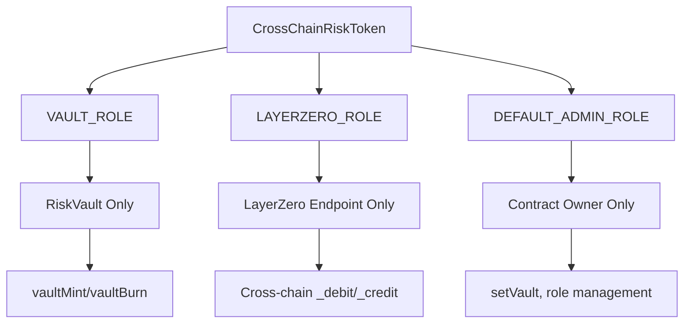

# LayerZero Cross-Chain Implementation Roadmap

## Executive Summary

This roadmap provides a complete plan for implementing cross-chain functionality for CoverVault's senior and junior risk tokens using LayerZero V2. The implementation will enable seamless token transfers across Hedera, Flow, and Mantle EVM mainnet chains while maintaining the existing vault security model.

## 📋 Project Overview

### Objective
Transform existing [`RiskToken.sol`](../contracts/RiskToken.sol) contracts into cross-chain enabled tokens using LayerZero's OFT (Omnichain Fungible Token) standard.

### Target Chains
- **Ethereum Mainnet** (Primary/Source chain)
- **Hedera Mainnet** (Chain ID: 295)  
- **Flow EVM Mainnet** (Chain ID: 747)
- **Mantle EVM Mainnet** (Chain ID: 5000)

### Key Benefits
- ✅ **Native Cross-Chain**: Tokens move seamlessly between chains
- ✅ **Security Preserved**: Existing vault-controlled minting maintained  
- ✅ **Backward Compatible**: All current functionality preserved
- ✅ **Future-Proof**: Easy to add new chains
- ✅ **Cost Effective**: ~$2-10 per cross-chain transfer

## 🏗️ Architecture Decision

### Selected Approach: **Hybrid OFT Implementation**

We've chosen to convert [`RiskToken.sol`](../contracts/RiskToken.sol) to a cross-chain native OFT rather than using adapters because:

1. **Simplicity**: Single contract handles both local and cross-chain operations
2. **Efficiency**: No additional wrapper contracts needed
3. **Gas Optimization**: Fewer contract calls and state updates
4. **Maintenance**: Easier to upgrade and maintain

### Access Control Model



## 📁 Documentation Structure

This implementation includes comprehensive documentation:

1. **[`LAYERZERO_CROSS_CHAIN_IMPLEMENTATION.md`](./LAYERZERO_CROSS_CHAIN_IMPLEMENTATION.md)** - Main implementation guide
2. **[`CONTRACT_IMPLEMENTATIONS.md`](./CONTRACT_IMPLEMENTATIONS.md)** - Complete contract code
3. **[`DEPLOYMENT_SCRIPTS.md`](./DEPLOYMENT_SCRIPTS.md)** - Deployment and configuration
4. **[`TESTING_AND_OPERATIONS.md`](./TESTING_AND_OPERATIONS.md)** - Testing and operations
5. **[`IMPLEMENTATION_ROADMAP.md`](./IMPLEMENTATION_ROADMAP.md)** - This roadmap

## 🚀 Implementation Phases

### Phase 1: Development & Testing (Weeks 1-2)

#### Week 1: Contract Development
- [ ] **Day 1-2**: Implement [`CrossChainRiskToken.sol`](../docs/CONTRACT_IMPLEMENTATIONS.md#1-crosschainrisktokensol)
- [ ] **Day 3-4**: Implement [`CrossChainRiskVault.sol`](../docs/CONTRACT_IMPLEMENTATIONS.md#2-crosschainriskvaultsol)  
- [ ] **Day 5**: Create mock contracts and interfaces
- [ ] **Weekend**: Code review and optimizations

#### Week 2: Testing & Configuration
- [ ] **Day 1-2**: Write comprehensive unit tests
- [ ] **Day 3**: Set up deployment scripts and configurations
- [ ] **Day 4**: Create LayerZero configuration files
- [ ] **Day 5**: Integration testing on local networks
- [ ] **Weekend**: Documentation review

### Phase 2: Testnet Deployment (Week 3)

#### Testnet Deployment Sequence
1. **Deploy Infrastructure**
   ```bash
   # Install dependencies
   npm install @layerzerolabs/layerzero-v2 @layerzerolabs/lz-evm-oapp-v2
   
   # Deploy to testnets
   npx hardhat deploy --network sepolia,hederaTestnet,flowTestnet,mantleTestnet --tags mocks,tokens,vault
   ```

2. **Configure LayerZero Pathways**
   ```bash
   # Wire senior tokens
   npx hardhat lz:oapp:wire --oapp-config layerzero.config.ts
   
   # Wire junior tokens  
   npx hardhat lz:oapp:wire --oapp-config layerzero-junior.config.ts
   ```

3. **Test Cross-Chain Transfers**
   ```bash
   # Test senior token transfer
   npx hardhat lz:oft:send --src-eid 40161 --dst-eid 40296 --to 0x... --amount 1000000000000000000
   ```

#### Testnet Validation Checklist
- [ ] All contracts deployed successfully
- [ ] LayerZero pathways configured
- [ ] Cross-chain transfers working
- [ ] Gas costs within expected range
- [ ] Emergency procedures tested
- [ ] Frontend integration tested

### Phase 3: Security & Audit (Week 4)

#### Security Review
- [ ] **Access control verification**: Ensure only vault can mint/burn locally
- [ ] **LayerZero configuration audit**: Verify trusted remotes and gas limits
- [ ] **Cross-chain consistency checks**: Validate token supply across chains
- [ ] **Emergency procedure testing**: Test emergency mode functionality
- [ ] **Gas optimization review**: Ensure efficient operations

#### Code Audit Checklist
- [ ] Static analysis (Slither, Mythril)
- [ ] Unit test coverage >95%
- [ ] Integration test coverage
- [ ] Cross-chain scenario testing
- [ ] Security best practices review

### Phase 4: Mainnet Deployment (Week 5)

#### Pre-Deployment Checklist
- [ ] All tests passing
- [ ] Security audit completed
- [ ] Gas costs optimized
- [ ] Documentation complete
- [ ] Team training completed
- [ ] Monitoring systems ready

#### Mainnet Deployment Sequence

1. **Deploy Contracts** (Deploy in this order)
   ```bash
   # Deploy senior tokens first
   npx hardhat deploy --network ethereum,hedera,flow,mantle --tags senior
   
   # Deploy junior tokens
   npx hardhat deploy --network ethereum,hedera,flow,mantle --tags junior
   
   # Deploy vaults last
   npx hardhat deploy --network ethereum,hedera,flow,mantle --tags vault
   ```

2. **Configure LayerZero**
   ```bash
   # Wire pathways (requires funded deployer on all chains)
   npx hardhat lz:oapp:wire --oapp-config layerzero.config.ts
   ```

3. **Verify Contracts**
   ```bash
   # Verify on all chains
   npx hardhat verify --network ethereum <CONTRACT_ADDRESS> <CONSTRUCTOR_ARGS>
   npx hardhat verify --network hedera <CONTRACT_ADDRESS> <CONSTRUCTOR_ARGS>
   npx hardhat verify --network flow <CONTRACT_ADDRESS> <CONSTRUCTOR_ARGS>
   npx hardhat verify --network mantle <CONTRACT_ADDRESS> <CONSTRUCTOR_ARGS>
   ```

#### Post-Deployment Validation
- [ ] All contracts verified on block explorers
- [ ] Cross-chain transfers working
- [ ] Monitoring systems active
- [ ] Emergency procedures documented
- [ ] Team access configured

### Phase 5: Production Launch (Week 6)

#### Soft Launch (Days 1-3)
- [ ] **Limited Release**: Start with small amounts
- [ ] **Monitor Performance**: Watch for any issues
- [ ] **User Testing**: Test with selected users
- [ ] **Gather Feedback**: Collect user experience data

#### Full Launch (Days 4-7)  
- [ ] **Public Announcement**: Announce cross-chain functionality
- [ ] **Documentation Published**: Release user guides
- [ ] **Support Ready**: Customer support trained
- [ ] **Monitoring Active**: 24/7 monitoring in place

## 💰 Cost Breakdown

### Development Costs
| Item | Estimated Cost |
|------|---------------|
| Development Time (2 weeks) | $20,000 - $40,000 |
| Security Audit | $10,000 - $20,000 |
| Testing & QA | $5,000 - $10,000 |
| **Total Development** | **$35,000 - $70,000** |

### Deployment Costs
| Network | Gas Cost (ETH equivalent) |
|---------|---------------------------|
| Ethereum | 0.05 - 0.1 ETH |
| Hedera | 0.01 - 0.02 ETH |
| Flow | 0.01 - 0.02 ETH |
| Mantle | 0.005 - 0.01 ETH |
| **Total Deployment** | **~0.075 - 0.15 ETH** |

### Operational Costs
| Item | Cost per Month |
|------|---------------|
| LayerZero Fees | $100 - $500 |
| Monitoring | $50 - $200 |
| Maintenance | $500 - $1,000 |
| **Total Monthly** | **$650 - $1,700** |

## 🛠️ Technical Requirements

### Infrastructure
- [ ] **Hardhat Development Environment**
- [ ] **LayerZero V2 SDK**
- [ ] **Multi-chain RPC Endpoints**
- [ ] **Deployment Keys & Accounts**
- [ ] **Block Explorer API Keys**

### Dependencies
```json
{
  "devDependencies": {
    "@layerzerolabs/layerzero-v2": "^2.3.3",
    "@layerzerolabs/lz-evm-oapp-v2": "^2.3.3", 
    "@layerzerolabs/lz-definitions": "^2.3.3",
    "@layerzerolabs/lz-v2-utilities": "^2.3.3",
    "@layerzerolabs/ua-devtools-evm-hardhat": "^0.3.6",
    "hardhat-deploy": "^0.11.45"
  }
}
```

### Environment Setup
```bash
# Install dependencies
npm install

# Set up environment variables
cp .env.example .env
# Fill in RPC URLs, private keys, API keys

# Compile contracts
npx hardhat compile

# Run tests
npx hardhat test
```

## 🔍 Risk Assessment

### Technical Risks
| Risk | Likelihood | Impact | Mitigation |
|------|------------|--------|------------|
| LayerZero pathway issues | Medium | High | Comprehensive testing, fallback procedures |
| Cross-chain consistency | Low | High | Automated monitoring, reconciliation tools |
| Gas cost volatility | High | Medium | Dynamic fee calculation, user warnings |
| Contract bugs | Low | High | Security audits, extensive testing |

### Business Risks  
| Risk | Likelihood | Impact | Mitigation |
|------|------------|--------|------------|
| User adoption | Medium | Medium | Clear documentation, user support |
| Regulatory changes | Low | High | Legal review, compliance monitoring |
| Competition | Medium | Low | Continuous improvement, feature expansion |

## 📊 Success Metrics

### Technical KPIs
- [ ] **Cross-chain transfer success rate**: >99%
- [ ] **Average transfer time**: <10 minutes
- [ ] **Gas cost efficiency**: <$10 per transfer
- [ ] **System uptime**: >99.9%

### Business KPIs
- [ ] **Cross-chain volume**: Track monthly growth
- [ ] **User adoption**: Number of users using cross-chain features
- [ ] **Cost savings**: Reduction in bridge fees vs alternatives
- [ ] **User satisfaction**: Support ticket volume and resolution time

## 🔗 Quick Links

### Development Resources
- [LayerZero V2 Documentation](https://docs.layerzero.network)
- [Hedera Developer Portal](https://docs.hedera.com)
- [Flow EVM Documentation](https://developers.flow.com/evm)
- [Mantle Developer Docs](https://docs.mantle.xyz)

### Implementation Files
- [`CrossChainRiskToken.sol`](./CONTRACT_IMPLEMENTATIONS.md#1-crosschainrisktokensol) - Main OFT implementation
- [`CrossChainRiskVault.sol`](./CONTRACT_IMPLEMENTATIONS.md#2-crosschainriskvaultsol) - Enhanced vault contract
- [`layerzero.config.ts`](./DEPLOYMENT_SCRIPTS.md#3-layerzero-configuration-layerzeroconfig.ts) - LayerZero configuration
- [`hardhat.config.ts`](./DEPLOYMENT_SCRIPTS.md#2-hardhat-configuration-hardhatconfig.ts) - Hardhat configuration

### Deployment Commands
```bash
# Full deployment pipeline
npm install
npx hardhat deploy --network ethereum,hedera,flow,mantle --tags tokens,vault
npx hardhat lz:oapp:wire --oapp-config layerzero.config.ts
npx hardhat verify --network ethereum <addresses>
```

## 🎯 Next Steps

### Immediate Actions (This Week)
1. **Review Documentation**: Go through all implementation docs
2. **Set Up Environment**: Install dependencies and configure networks  
3. **Start Development**: Begin implementing contracts
4. **Plan Resources**: Allocate team members and timeline

### Short Term (Next 2 Weeks)
1. **Complete Development**: Finish contract implementation
2. **Write Tests**: Comprehensive test suite
3. **Deploy to Testnets**: Test cross-chain functionality
4. **Security Review**: Initial security assessment

### Medium Term (Next Month)
1. **Security Audit**: Professional code audit
2. **Mainnet Deployment**: Production deployment
3. **Launch Preparation**: Documentation and support
4. **Go Live**: Public launch with monitoring

This roadmap provides a comprehensive path to implementing cross-chain functionality for your risk tokens. The phased approach ensures thorough testing and validation while minimizing risks. Each phase builds upon the previous one, creating a robust and reliable cross-chain token system.

**Ready to begin? Start with reviewing the [contract implementations](./CONTRACT_IMPLEMENTATIONS.md) and setting up your development environment!**