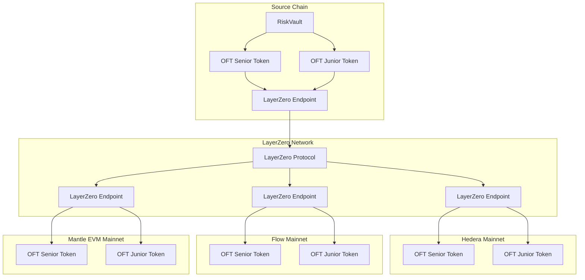

# LayerZero Cross-Chain Implementation for CoverVault Risk Tokens

## Overview

This document provides a comprehensive guide to implement cross-chain functionality for CoverVault's senior and junior risk tokens using LayerZero V2. The implementation will enable seamless transfers of CV-SENIOR and CV-JUNIOR tokens across Hedera, Flow, and Mantle EVM mainnet chains.

## Architecture Overview

### Current Architecture
- **RiskVault**: Main contract that manages deposits, withdrawals, and token lifecycle
- **RiskToken**: ERC20 tokens (CV-SENIOR and CV-JUNIOR) with vault-controlled minting/burning
- **Proportional System**: Equal amounts of senior and junior tokens are issued for each deposit

### Proposed Cross-Chain Architecture



## Implementation Strategy

### Phase 1: Convert RiskToken to OFT
1. **Hybrid Access Control**: Maintain vault-only minting for local operations while enabling LayerZero cross-chain transfers
2. **Preserve Existing Logic**: Keep all current vault mechanics intact
3. **Security Model**: Use role-based access control to separate local and cross-chain operations

### Phase 2: Deploy Across Target Chains
1. **Hedera Mainnet**: Deploy OFT contracts with Hedera-specific configurations
2. **Flow Mainnet**: Deploy OFT contracts with Flow-specific configurations  
3. **Mantle EVM Mainnet**: Deploy OFT contracts with Mantle-specific configurations

### Phase 3: Configuration and Wiring
1. **LayerZero Configuration**: Set up cross-chain pathways and trusted remotes
2. **Gas and Fee Management**: Configure execution parameters for each chain
3. **Testing and Validation**: Comprehensive testing across all chains

## Technical Specifications

### LayerZero Endpoint IDs
- **Ethereum Mainnet**: 30101
- **Hedera Mainnet**: 30296
- **Flow Mainnet**: 30294
- **Mantle Mainnet**: 30181

### Gas Limits and Fees
- **Cross-chain Transfer**: 200,000 gas
- **Compose Calls**: 500,000 gas
- **Native Drop**: 50,000 gas

### Token Specifications
- **Decimals**: 18 (consistent across all chains)
- **Total Supply**: Managed by vault proportional system
- **Cross-chain Limit**: No artificial limits, controlled by vault logic

## Implementation Steps

### Step 1: Install LayerZero Dependencies

```bash
npm install @layerzerolabs/layerzero-v2
npm install @layerzerolabs/lz-evm-oapp-v2
npm install @layerzerolabs/lz-definitions
npm install @layerzerolabs/lz-v2-utilities
```

### Step 2: Contract Modifications

#### A. Create CrossChainRiskToken (OFT Implementation)

**File**: `contracts/CrossChainRiskToken.sol`

```solidity
// SPDX-License-Identifier: MIT
pragma solidity ^0.8.28;

import "@layerzerolabs/lz-evm-oapp-v2/contracts/oft/OFT.sol";
import "@openzeppelin/contracts/access/AccessControl.sol";

contract CrossChainRiskToken is OFT, AccessControl {
    bytes32 public constant VAULT_ROLE = keccak256("VAULT_ROLE");
    bytes32 public constant LAYERZERO_ROLE = keccak256("LAYERZERO_ROLE");
    
    error UnauthorizedMinter();
    error UnauthorizedBurner();
    
    event VaultMint(address indexed to, uint256 amount);
    event VaultBurn(address indexed from, uint256 amount);
    
    constructor(
        string memory _name,
        string memory _symbol,
        address _lzEndpoint,
        address _delegate,
        address _vault
    ) OFT(_name, _symbol, _lzEndpoint, _delegate) {
        _grantRole(DEFAULT_ADMIN_ROLE, _delegate);
        _grantRole(VAULT_ROLE, _vault);
        _grantRole(LAYERZERO_ROLE, _lzEndpoint);
    }
    
    /**
     * @dev Vault-controlled minting for local deposits
     */
    function vaultMint(address to, uint256 amount) external onlyRole(VAULT_ROLE) {
        _mint(to, amount);
        emit VaultMint(to, amount);
    }
    
    /**
     * @dev Vault-controlled burning for local withdrawals
     */
    function vaultBurn(address from, uint256 amount) external onlyRole(VAULT_ROLE) {
        _burn(from, amount);
        emit VaultBurn(from, amount);
    }
    
    /**
     * @dev Override _debit for cross-chain transfers (burn tokens)
     */
    function _debit(
        uint256 _amountLD,
        uint256 _minAmountLD,
        uint32 _dstEid
    ) internal virtual override returns (uint256 amountSentLD, uint256 amountReceivedLD) {
        amountSentLD = _amountLD;
        amountReceivedLD = _removeDust(_amountLD);
        
        // Burn tokens for cross-chain transfer
        _burn(msg.sender, amountSentLD);
    }
    
    /**
     * @dev Override _credit for cross-chain receipts (mint tokens)
     */
    function _credit(
        address _to,
        uint256 _amountLD,
        uint32 _srcEid
    ) internal virtual override returns (uint256 amountReceivedLD) {
        amountReceivedLD = _amountLD;
        
        // Mint tokens for cross-chain receipt
        _mint(_to, amountReceivedLD);
    }
    
    /**
     * @dev Set vault address (admin only)
     */
    function setVault(address newVault) external onlyRole(DEFAULT_ADMIN_ROLE) {
        _revokeRole(VAULT_ROLE, getRoleMember(VAULT_ROLE, 0));
        _grantRole(VAULT_ROLE, newVault);
    }
}
```

#### B. Update RiskVault to Use CrossChainRiskToken

**File**: `contracts/CrossChainRiskVault.sol`

```solidity
// SPDX-License-Identifier: MIT
pragma solidity ^0.8.28;

import "./RiskVault.sol";
import "./CrossChainRiskToken.sol";

contract CrossChainRiskVault is RiskVault {
    constructor(
        address _aUSDC, 
        address _cUSDT,
        address _lzEndpoint
    ) RiskVault(_aUSDC, _cUSDT) {
        // Deploy cross-chain risk tokens
        CrossChainRiskToken _seniorToken = new CrossChainRiskToken(
            "CoverVault Senior Token",
            "CV-SENIOR",
            _lzEndpoint,
            msg.sender,  // delegate
            address(this) // vault
        );
        
        CrossChainRiskToken _juniorToken = new CrossChainRiskToken(
            "CoverVault Junior Token", 
            "CV-JUNIOR",
            _lzEndpoint,
            msg.sender,  // delegate
            address(this) // vault
        );
        
        // Update token addresses
        seniorToken = address(_seniorToken);
        juniorToken = address(_juniorToken);
    }
    
    /**
     * @dev Override token issuance to use cross-chain tokens
     */
    function _issueTokens(address recipient, uint256 totalAmount) internal override {
        uint256 eachTokenAmount = totalAmount / 2;
        CrossChainRiskToken(seniorToken).vaultMint(recipient, eachTokenAmount);
        CrossChainRiskToken(juniorToken).vaultMint(recipient, eachTokenAmount);
        totalTokensIssued += totalAmount;
    }
    
    /**
     * @dev Override token burning to use cross-chain tokens
     */
    function _burnTokens(
        address tokenHolder,
        uint256 seniorAmount,
        uint256 juniorAmount
    ) internal override {
        uint256 totalToBurn = seniorAmount + juniorAmount;
        if (totalToBurn == 0) revert NoTokensToWithdraw();

        if (seniorAmount > 0) {
            if (IERC20(seniorToken).balanceOf(tokenHolder) < seniorAmount) {
                revert InsufficientTokenBalance();
            }
            CrossChainRiskToken(seniorToken).vaultBurn(tokenHolder, seniorAmount);
        }
        
        if (juniorAmount > 0) {
            if (IERC20(juniorToken).balanceOf(tokenHolder) < juniorAmount) {
                revert InsufficientTokenBalance();
            }
            CrossChainRiskToken(juniorToken).vaultBurn(tokenHolder, juniorAmount);
        }

        totalTokensIssued -= totalToBurn;
    }
}
```

### Step 3: LayerZero Configuration

#### A. Create LayerZero Configuration File

**File**: `layerzero.config.ts`

```typescript
import { EndpointId } from '@layerzerolabs/lz-definitions'
import type { OAppOmniGraphHardhat, OmniPointHardhat } from '@layerzerolabs/ua-devtools-evm-hardhat'

// Define contract points for each chain
const ethereumContract: OmniPointHardhat = {
    eid: EndpointId.ETHEREUM_V2_MAINNET,
    contractName: 'CrossChainRiskToken',
}

const hederaContract: OmniPointHardhat = {
    eid: EndpointId.HEDERA_V2_MAINNET,
    contractName: 'CrossChainRiskToken',
}

const flowContract: OmniPointHardhat = {
    eid: EndpointId.FLOW_V2_MAINNET,
    contractName: 'CrossChainRiskToken',
}

const mantleContract: OmniPointHardhat = {
    eid: EndpointId.MANTLE_V2_MAINNET,
    contractName: 'CrossChainRiskToken',
}

const config: OAppOmniGraphHardhat = {
    contracts: [
        {
            contract: ethereumContract,
        },
        {
            contract: hederaContract,
        },
        {
            contract: flowContract,
        },
        {
            contract: mantleContract,
        },
    ],
    connections: [
        // Ethereum <-> Hedera
        {
            from: ethereumContract,
            to: hederaContract,
            config: {
                enforcedOptions: [
                    {
                        msgType: 1,
                        optionType: 1, // LZ_RECEIVE
                        gas: 200000,
                    },
                ],
            },
        },
        {
            from: hederaContract,
            to: ethereumContract,
            config: {
                enforcedOptions: [
                    {
                        msgType: 1,
                        optionType: 1,
                        gas: 200000,
                    },
                ],
            },
        },
        // Ethereum <-> Flow
        {
            from: ethereumContract,
            to: flowContract,
            config: {
                enforcedOptions: [
                    {
                        msgType: 1,
                        optionType: 1,
                        gas: 200000,
                    },
                ],
            },
        },
        {
            from: flowContract,
            to: ethereumContract,
            config: {
                enforcedOptions: [
                    {
                        msgType: 1,
                        optionType: 1,
                        gas: 200000,
                    },
                ],
            },
        },
        // Ethereum <-> Mantle
        {
            from: ethereumContract,
            to: mantleContract,
            config: {
                enforcedOptions: [
                    {
                        msgType: 1,
                        optionType: 1,
                        gas: 200000,
                    },
                ],
            },
        },
        {
            from: mantleContract,
            to: ethereumContract,
            config: {
                enforcedOptions: [
                    {
                        msgType: 1,
                        optionType: 1,
                        gas: 200000,
                    },
                ],
            },
        },
        // Hedera <-> Flow
        {
            from: hederaContract,
            to: flowContract,
            config: {
                enforcedOptions: [
                    {
                        msgType: 1,
                        optionType: 1,
                        gas: 200000,
                    },
                ],
            },
        },
        {
            from: flowContract,
            to: hederaContract,
            config: {
                enforcedOptions: [
                    {
                        msgType: 1,
                        optionType: 1,
                        gas: 200000,
                    },
                ],
            },
        },
        // Hedera <-> Mantle
        {
            from: hederaContract,
            to: mantleContract,
            config: {
                enforcedOptions: [
                    {
                        msgType: 1,
                        optionType: 1,
                        gas: 200000,
                    },
                ],
            },
        },
        {
            from: mantleContract,
            to: hederaContract,
            config: {
                enforcedOptions: [
                    {
                        msgType: 1,
                        optionType: 1,
                        gas: 200000,
                    },
                ],
            },
        },
        // Flow <-> Mantle
        {
            from: flowContract,
            to: mantleContract,
            config: {
                enforcedOptions: [
                    {
                        msgType: 1,
                        optionType: 1,
                        gas: 200000,
                    },
                ],
            },
        },
        {
            from: mantleContract,
            to: flowContract,
            config: {
                enforcedOptions: [
                    {
                        msgType: 1,
                        optionType: 1,
                        gas: 200000,
                    },
                ],
            },
        },
    ],
}

export default config
```

### Step 4: Hardhat Configuration Updates

#### A. Update hardhat.config.ts

```typescript
import { HardhatUserConfig } from 'hardhat/config'
import '@nomicfoundation/hardhat-toolbox'
import '@layerzerolabs/ua-devtools-evm-hardhat'

const config: HardhatUserConfig = {
    solidity: {
        version: '0.8.28',
        settings: {
            optimizer: {
                enabled: true,
                runs: 200,
            },
        },
    },
    networks: {
        ethereum: {
            url: process.env.ETHEREUM_RPC_URL || '',
            accounts: process.env.PRIVATE_KEY ? [process.env.PRIVATE_KEY] : [],
        },
        hedera: {
            url: process.env.HEDERA_RPC_URL || 'https://mainnet.hashio.io/api',
            accounts: process.env.PRIVATE_KEY ? [process.env.PRIVATE_KEY] : [],
        },
        flow: {
            url: process.env.FLOW_RPC_URL || 'https://mainnet.evm.nodes.onflow.org',
            accounts: process.env.PRIVATE_KEY ? [process.env.PRIVATE_KEY] : [],
        },
        mantle: {
            url: process.env.MANTLE_RPC_URL || 'https://rpc.mantle.xyz',
            accounts: process.env.PRIVATE_KEY ? [process.env.PRIVATE_KEY] : [],
        },
    },
    etherscan: {
        apiKey: {
            ethereum: process.env.ETHERSCAN_API_KEY || '',
            hedera: process.env.HEDERA_API_KEY || '',
            flow: process.env.FLOW_API_KEY || '',
            mantle: process.env.MANTLE_API_KEY || '',
        },
        customChains: [
            {
                network: 'hedera',
                chainId: 295,
                urls: {
                    apiURL: 'https://server-verify.hashscan.io',
                    browserURL: 'https://hashscan.io',
                },
            },
            {
                network: 'flow',
                chainId: 747,
                urls: {
                    apiURL: 'https://evm.flowscan.org/api',
                    browserURL: 'https://evm.flowscan.org',
                },
            },
            {
                network: 'mantle',
                chainId: 5000,
                urls: {
                    apiURL: 'https://api.mantlescan.io/api',
                    browserURL: 'https://mantlescan.io',
                },
            },
        ],
    },
}

export default config
```

### Step 5: Deployment Scripts

#### A. Senior Token Deployment Script

**File**: `deploy/01-deploy-senior-token.ts`

```typescript
import { DeployFunction } from 'hardhat-deploy/types'
import { HardhatRuntimeEnvironment } from 'hardhat/types'

const deployFunction: DeployFunction = async function (hre: HardhatRuntimeEnvironment) {
    const { deployments, getNamedAccounts, network } = hre
    const { deploy } = deployments
    const { deployer } = await getNamedAccounts()

    // LayerZero endpoints for each network
    const endpoints: Record<string, string> = {
        ethereum: '0x1a44076050125825900e736c501f859c50fE728c',
        hedera: '0x1a44076050125825900e736c501f859c50fE728c', 
        flow: '0x1a44076050125825900e736c501f859c50fE728c',
        mantle: '0x1a44076050125825900e736c501f859c50fE728c',
    }

    const lzEndpoint = endpoints[network.name]
    if (!lzEndpoint) {
        throw new Error(`LayerZero endpoint not found for network: ${network.name}`)
    }

    await deploy('CrossChainRiskTokenSenior', {
        from: deployer,
        contract: 'CrossChainRiskToken',
        args: [
            'CoverVault Senior Token',
            'CV-SENIOR',
            lzEndpoint,
            deployer, // delegate
            deployer, // temporary vault (will be updated after vault deployment)
        ],
        log: true,
        waitConfirmations: 1,
    })
}

deployFunction.tags = ['CrossChainRiskTokenSenior', 'senior']
deployFunction.dependencies = []

export default deployFunction
```

#### B. Junior Token Deployment Script

**File**: `deploy/02-deploy-junior-token.ts`

```typescript
import { DeployFunction } from 'hardhat-deploy/types'
import { HardhatRuntimeEnvironment } from 'hardhat/types'

const deployFunction: DeployFunction = async function (hre: HardhatRuntimeEnvironment) {
    const { deployments, getNamedAccounts, network } = hre
    const { deploy } = deployments
    const { deployer } = await getNamedAccounts()

    // LayerZero endpoints for each network
    const endpoints: Record<string, string> = {
        ethereum: '0x1a44076050125825900e736c501f859c50fE728c',
        hedera: '0x1a44076050125825900e736c501f859c50fE728c',
        flow: '0x1a44076050125825900e736c501f859c50fE728c', 
        mantle: '0x1a44076050125825900e736c501f859c50fE728c',
    }

    const lzEndpoint = endpoints[network.name]
    if (!lzEndpoint) {
        throw new Error(`LayerZero endpoint not found for network: ${network.name}`)
    }

    await deploy('CrossChainRiskTokenJunior', {
        from: deployer,
        contract: 'CrossChainRiskToken',
        args: [
            'CoverVault Junior Token',
            'CV-JUNIOR',
            lzEndpoint,
            deployer, // delegate
            deployer, // temporary vault (will be updated after vault deployment)
        ],
        log: true,
        waitConfirmations: 1,
    })
}

deployFunction.tags = ['CrossChainRiskTokenJunior', 'junior']
deployFunction.dependencies = []

export default deployFunction
```

#### C. Vault Deployment Script

**File**: `deploy/03-deploy-vault.ts`

```typescript
import { DeployFunction } from 'hardhat-deploy/types'
import { HardhatRuntimeEnvironment } from 'hardhat/types'

const deployFunction: DeployFunction = async function (hre: HardhatRuntimeEnvironment) {
    const { deployments, getNamedAccounts, ethers, network } = hre
    const { deploy, get } = deployments
    const { deployer } = await getNamedAccounts()

    // Mock token addresses for each network (replace with actual addresses)
    const mockTokens: Record<string, { aUSDC: string; cUSDT: string }> = {
        ethereum: {
            aUSDC: '0xA0b86a33E6441f8EF9b8B5cc3CB6eD6bFF85d4bB', // Real aUSDC on Ethereum
            cUSDT: '0xf650C3d88D12dB855b8bf7D11Be6C55A4e07dCC9', // Real cUSDT on Ethereum
        },
        hedera: {
            aUSDC: '0x0000000000000000000000000000000000000000', // Deploy mock or use bridged version
            cUSDT: '0x0000000000000000000000000000000000000000', // Deploy mock or use bridged version
        },
        flow: {
            aUSDC: '0x0000000000000000000000000000000000000000', // Deploy mock or use bridged version
            cUSDT: '0x0000000000000000000000000000000000000000', // Deploy mock or use bridged version
        },
        mantle: {
            aUSDC: '0x0000000000000000000000000000000000000000', // Deploy mock or use bridged version
            cUSDT: '0x0000000000000000000000000000000000000000', // Deploy mock or use bridged version
        },
    }

    // LayerZero endpoints
    const endpoints: Record<string, string> = {
        ethereum: '0x1a44076050125825900e736c501f859c50fE728c',
        hedera: '0x1a44076050125825900e736c501f859c50fE728c',
        flow: '0x1a44076050125825900e736c501f859c50fE728c',
        mantle: '0x1a44076050125825900e736c501f859c50fE728c',
    }

    const tokens = mockTokens[network.name]
    const lzEndpoint = endpoints[network.name]

    if (!tokens || !lzEndpoint) {
        throw new Error(`Configuration not found for network: ${network.name}`)
    }

    const vault = await deploy('CrossChainRiskVault', {
        from: deployer,
        args: [tokens.aUSDC, tokens.cUSDT, lzEndpoint],
        log: true,
        waitConfirmations: 1,
    })

    // Update token vault addresses
    const seniorToken = await get('CrossChainRiskTokenSenior')
    const juniorToken = await get('CrossChainRiskTokenJunior')

    const seniorContract = await ethers.getContractAt('CrossChainRiskToken', seniorToken.address)
    const juniorContract = await ethers.getContractAt('CrossChainRiskToken', juniorToken.address)

    // Set vault address in tokens
    await seniorContract.setVault(vault.address)
    await juniorContract.setVault(vault.address)

    console.log(`Senior Token: ${seniorToken.address}`)
    console.log(`Junior Token: ${juniorToken.address}`)
    console.log(`Vault: ${vault.address}`)
}

deployFunction.tags = ['CrossChainRiskVault', 'vault']
deployFunction.dependencies = ['CrossChainRiskTokenSenior', 'CrossChainRiskTokenJunior']

export default deployFunction
```

### Step 6: Deployment Commands

```bash
# Deploy to all networks
npx hardhat lz:deploy --tags senior,junior,vault

# Wire contracts across chains
npx hardhat lz:oapp:wire --oapp-config layerzero.config.ts

# Verify contracts
npx hardhat verify --network ethereum <CONTRACT_ADDRESS> <CONSTRUCTOR_ARGS>
npx hardhat verify --network hedera <CONTRACT_ADDRESS> <CONSTRUCTOR_ARGS>
npx hardhat verify --network flow <CONTRACT_ADDRESS> <CONSTRUCTOR_ARGS>
npx hardhat verify --network mantle <CONTRACT_ADDRESS> <CONSTRUCTOR_ARGS>
```

### Step 7: Cross-Chain Transfer Usage

#### A. Transfer Tokens Cross-Chain

```typescript
// Example: Transfer Senior tokens from Ethereum to Hedera
import { ethers } from 'hardhat'

async function transferCrossChain() {
    const [signer] = await ethers.getSigners()
    const seniorToken = await ethers.getContract('CrossChainRiskTokenSenior')
    
    // Parameters for cross-chain transfer
    const dstEid = 30296 // Hedera endpoint ID
    const to = ethers.utils.hexZeroPad(signer.address, 32) // Recipient address
    const amountLD = ethers.utils.parseEther('100') // Amount to send
    const minAmountLD = ethers.utils.parseEther('99') // Minimum amount to receive
    const extraOptions = '0x' // Default options
    const composeMsg = '0x' // No compose message
    const oftCmd = '0x' // No OFT command
    
    const sendParam = {
        dstEid,
        to,
        amountLD,
        minAmountLD,
        extraOptions,
        composeMsg,
        oftCmd,
    }
    
    // Quote the fee
    const [nativeFee] = await seniorToken.quoteSend(sendParam, false)
    
    // Send the tokens
    const tx = await seniorToken.send(sendParam, [nativeFee, 0], signer.address, {
        value: nativeFee,
    })
    
    await tx.wait()
    console.log(`Cross-chain transfer completed: ${tx.hash}`)
}
```

## Security Considerations

### Access Control
- **Vault Role**: Only RiskVault can mint/burn tokens for local operations
- **LayerZero Role**: Only LayerZero endpoint can handle cross-chain operations
- **Admin Role**: Can update vault address and manage permissions

### Cross-Chain Security
- **Trusted Remotes**: Only configured chains can send/receive tokens
- **Gas Limits**: Enforced options prevent DOS attacks
- **Amount Validation**: Min/max amount checks prevent dust attacks

### Upgrade Safety
- **Proxy Pattern**: Consider using upgradeable proxies for future updates
- **Migration Plan**: Develop strategy for migrating existing token holders
- **Testing**: Comprehensive testing on testnets before mainnet deployment

## Testing Strategy

### Unit Tests
- Test all vault operations with cross-chain tokens
- Verify access control for minting/burning
- Test cross-chain transfer scenarios

### Integration Tests
- Test full cross-chain workflows
- Verify fee calculations and gas usage
- Test error scenarios and edge cases

### Mainnet Testing
- Start with small amounts on testnets
- Gradually increase amounts after successful tests
- Monitor for any unexpected behavior

## Monitoring and Maintenance

### Key Metrics
- Cross-chain transfer volume
- Failed transaction rates
- Gas usage efficiency
- Token supply consistency across chains

### Maintenance Tasks
- Regular LayerZero configuration updates
- Monitor for new chain additions
- Update gas limits based on network conditions
- Security audits for contract updates

## Cost Estimation

### Deployment Costs
- **Per Chain**: ~0.05-0.1 ETH equivalent for deployment
- **Total for 4 chains**: ~0.2-0.4 ETH equivalent

### Cross-Chain Transfer Costs
- **LayerZero Fee**: ~$1-5 per transfer
- **Gas Costs**: Variable by destination chain
- **Total**: ~$2-10 per cross-chain transfer

## Conclusion

This implementation provides a robust, secure, and scalable solution for making CoverVault's risk tokens cross-chain compatible. The hybrid approach maintains the integrity of your existing vault system while enabling seamless cross-chain transfers through LayerZero V2.

The solution is designed to be:
- **Secure**: Role-based access control and LayerZero security guarantees
- **Scalable**: Easy to add new chains in the future
- **Maintainable**: Clear separation of concerns and comprehensive monitoring
- **Cost-Effective**: Optimized gas usage and minimal LayerZero fees